# `crates/praxis-graphlaw/tests/self_monitoring_real_session_actuation.rs`

Source SHA-256: `a0af33a437d331e8aadd843a642a69dd2432c1e3f397a9282f6e6759ad6d5af9`

```mermaid
classDiagram
    class fn_extract_action_construct_query {
      <<fn>>
    }
    class fn_turn_seq {
      <<fn>>
    }
    class struct_EscNode {
      <<struct>>
      +"priors: Vec~String~"
      +"repeats: Vec~String~"
      +"reasons: Vec~String~"
    }
    class fn_run_via_oxigraph {
      <<fn>>
    }
    class fn_list_grounding_questions {
      <<fn>>
    }
    class fn_run_via_triplestore {
      <<fn>>
    }
    class fn_triplestore_escalation_rows {
      <<fn>>
    }
    class fn_adversarial_pair_turtle {
      <<fn>>
    }
    class fn_construct_query_is_verbatim_hook_ttl_substring {
      <<fn>>
    }
    class fn_real_session_default_heuristic_zero_escalations_oxigraph {
      <<fn>>
    }
    class fn_real_session_default_heuristic_zero_escalations_triplestore {
      <<fn>>
    }
    class fn_adversarial_run_and_blocker_responses_never_fire_inside_real_session_graph {
      <<fn>>
    }
    class fn_broadened_topic_experiment_fires_correctly_and_before_real_frustration_turn_oxigraph {
      <<fn>>
    }
    class fn_broadened_topic_experiment_via_triplestore_matches_oxigraph_after_blank_node_fix {
      <<fn>>
    }
```

## Dependencies

- `oxigraph::io::{RdfFormat, RdfParser}`
- `oxigraph::sparql::{QueryResults, QuerySolution, SparqlEvaluator}`
- `oxigraph::store::Store`
- `praxis_graphlaw::TripleStore`
- `praxis_graphlaw::parser::Syntax`
- `std::collections::BTreeMap`

## Standing

- Structural parse: `ALIVE`
- Runtime behavior: `UNKNOWN`
