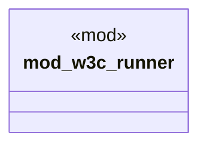

# `crates/praxis-graphlaw/tests/shacl_conformance/main.rs`

Source SHA-256: `9dfb6e6f9dfab08b7fc157799627a2f19bda406b97356a9423d0fd11cf01db75`

## Dependencies

- None observed.

## Standing

- Structural parse: `ALIVE`
- Runtime behavior: `UNKNOWN`
