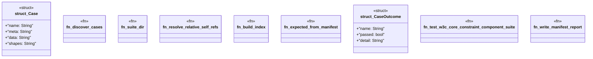

# `crates/praxis-graphlaw/tests/shacl_conformance/w3c_runner.rs`

Source SHA-256: `eefa0af5f8702e250d30c2a3afdeebff2c10d1c3a1484aaf77a631e0e792f8c0`

## Dependencies

- `praxis_graphlaw::parser::{Parser, Syntax}`
- `praxis_graphlaw::shacl::{ShapesGraph, Validator}`
- `praxis_graphlaw::tripleindex::TripleIndex`
- `std::fs`
- `std::path::{Path, PathBuf}`

## Standing

- Structural parse: `ALIVE`
- Runtime behavior: `UNKNOWN`
