# `crates/praxis-graphlaw/tests/shacl_impossible.rs`

Source SHA-256: `840c83e5b54f4acc26da6534082f096cb11eebdd908320bc0cf262eaa3ebfba2`

```mermaid
classDiagram
    class fn_build_data_index {
      <<fn>>
    }
    class fn_test_hasvalue_outside_in_list_never_conforms {
      <<fn>>
    }
    class fn_test_class_and_not_class_direct_self_negation_never_conforms {
      <<fn>>
    }
    class fn_test_xone_over_coextensive_shapes_never_conforms {
      <<fn>>
    }
    class fn_test_qualified_mincount_exceeds_maxcount_never_conforms {
      <<fn>>
    }
    class fn_test_languagein_and_integer_datatype_never_conforms {
      <<fn>>
    }
```

## Dependencies

- `praxis_graphlaw::parser::{Parser, Syntax}`
- `praxis_graphlaw::shacl::{ShapesGraph, Validator}`
- `praxis_graphlaw::tripleindex::TripleIndex`
- `proptest::prelude::*`

## Standing

- Structural parse: `ALIVE`
- Runtime behavior: `UNKNOWN`
