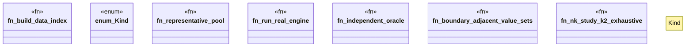

# `crates/praxis-graphlaw/tests/shacl_nk_study.rs`

Source SHA-256: `c74e338a777aebb7f5493e24fa9a98de9ce44e2ae042f7a448c94f49224e947e`

## Dependencies

- `praxis_graphlaw::parser::{Parser, Syntax}`
- `praxis_graphlaw::shacl::{ShapesGraph, Validator}`
- `praxis_graphlaw::tripleindex::TripleIndex`
- `proptest::prelude::*`

## Standing

- Structural parse: `ALIVE`
- Runtime behavior: `UNKNOWN`
