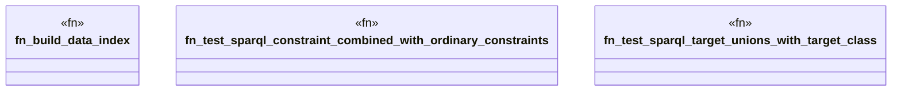

# `crates/praxis-graphlaw/tests/shacl_sparql_stress.rs`

Source SHA-256: `188945ced9aa72f5a71db22cffc1f833101278b07046aa7c65e3bad1f7ab8a90`

## Dependencies

- `praxis_graphlaw::parser::{Parser, Syntax}`
- `praxis_graphlaw::shacl::{ShapesGraph, Validator}`
- `praxis_graphlaw::tripleindex::TripleIndex`

## Standing

- Structural parse: `ALIVE`
- Runtime behavior: `UNKNOWN`
