# `crates/praxis-graphlaw/tests/shacl_stress.rs`

Source SHA-256: `bc8cfd97573742224c092ad76ce439804cd5ef3dc220ad6cd03ea846b473d732`

```mermaid
classDiagram
    class fn_build_data_index {
      <<fn>>
    }
    class fn_test_counterfactual_contradictory_and_never_conforms {
      <<fn>>
    }
    class fn_test_counterfactual_not_of_unsatisfiable_always_conforms {
      <<fn>>
    }
    class fn_test_counterfactual_xone_rejects_multiple_matches {
      <<fn>>
    }
    class fn_test_large_scale_validation_1000_focus_nodes {
      <<fn>>
    }
    class fn_test_counterfactual_numeric_range_exact_boundary {
      <<fn>>
    }
    class fn_test_datetime_timezone_mismatch_is_indeterminate_and_violates {
      <<fn>>
    }
    class fn_test_three_level_nested_property_shape {
      <<fn>>
    }
```

## Dependencies

- `praxis_graphlaw::parser::{Parser, Syntax}`
- `praxis_graphlaw::shacl::{ShapesGraph, Validator}`
- `praxis_graphlaw::tripleindex::TripleIndex`
- `std::time::{Duration, Instant}`

## Standing

- Structural parse: `ALIVE`
- Runtime behavior: `UNKNOWN`
