# `crates/praxis-graphlaw/tests/shacl_validation.rs`

Source SHA-256: `9ac88266e3a8451543170c28603cb36f7410366d9b0288051f67936034b6c166`

```mermaid
classDiagram
    class fn_build_data_index {
      <<fn>>
    }
    class fn_test_min_max_count_violation {
      <<fn>>
    }
    class fn_test_datatype_constraint_pass_fail {
      <<fn>>
    }
    class fn_test_class_constraint {
      <<fn>>
    }
    class fn_test_and_or_not_logical_constraints {
      <<fn>>
    }
    class fn_test_conforms_true_for_valid_graph {
      <<fn>>
    }
    class fn_test_empty_dataset {
      <<fn>>
    }
    class fn_test_invalid_turtle_shapes {
      <<fn>>
    }
    class fn_test_recursive_shapes {
      <<fn>>
    }
    class fn_test_property_paths_comprehensive {
      <<fn>>
    }
    class fn_test_severity_and_datatype {
      <<fn>>
    }
    class fn_test_message_prefers_plain_literal_over_language_tagged {
      <<fn>>
    }
    class fn_test_message_prefers_english_when_no_plain_literal {
      <<fn>>
    }
    class fn_test_sparql_ask_constraint {
      <<fn>>
    }
    class fn_test_sparql_select_constraint {
      <<fn>>
    }
    class fn_test_sparql_target {
      <<fn>>
    }
    class fn_test_subclass_closure_cycles_and_multiple_inheritance {
      <<fn>>
    }
```

## Dependencies

- `praxis_graphlaw::parser::{Parser, Syntax}`
- `praxis_graphlaw::shacl::{ShapesGraph, Validator}`
- `praxis_graphlaw::tripleindex::TripleIndex`

## Standing

- Structural parse: `ALIVE`
- Runtime behavior: `UNKNOWN`
