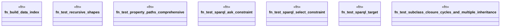

# `crates/praxis-graphlaw/tests/shacl_validation_extended.rs`

Source SHA-256: `fd783ba191f32952aa76f2653203408224c467c71bb20490c1ea9e09c68b967a`

## Dependencies

- `praxis_graphlaw::parser::{Parser, Syntax}`
- `praxis_graphlaw::shacl::{ShapesGraph, Validator}`
- `praxis_graphlaw::tripleindex::TripleIndex`

## Standing

- Structural parse: `ALIVE`
- Runtime behavior: `UNKNOWN`
