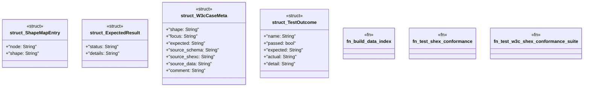

# `crates/praxis-graphlaw/tests/shex_conformance/main.rs`

Source SHA-256: `45a34a01b46b0367911c24b790e0ceabecf8655139a00819e3e288ac84952ac0`

## Dependencies

- `praxis_graphlaw::parser::{Parser, Syntax}`
- `praxis_graphlaw::shex::validate_shex`
- `praxis_graphlaw::tripleindex::TripleIndex`
- `std::fs`
- `std::path::Path`

## Standing

- Structural parse: `ALIVE`
- Runtime behavior: `UNKNOWN`
