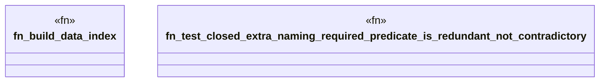

# `crates/praxis-graphlaw/tests/shex_impossible.rs`

Source SHA-256: `4d84bddb86c39d2ec41782f4d1cd53e4ea4ad79ccd81adc7e769de9c99c49963`

## Dependencies

- `praxis_graphlaw::parser::{Parser, Syntax}`
- `praxis_graphlaw::shex::validate_shex`
- `praxis_graphlaw::tripleindex::TripleIndex`
- `proptest::prelude::*`

## Standing

- Structural parse: `ALIVE`
- Runtime behavior: `UNKNOWN`
