# `crates/praxis-graphlaw/tests/shex_stress.rs`

Source SHA-256: `5c633cd52d957af68041597bb72c5acafcf7f44c5783e6278bc5abb3718b4418`

```mermaid
classDiagram
    class fn_build_data_index {
      <<fn>>
    }
    class fn_test_counterfactual_length_facet_exact_boundary {
      <<fn>>
    }
    class fn_test_counterfactual_numeric_range_exact_boundary {
      <<fn>>
    }
    class fn_test_counterfactual_closed_extra_allowlist_is_specific {
      <<fn>>
    }
    class fn_test_large_scale_shex_validation_1000_nodes {
      <<fn>>
    }
    class fn_test_shex_validates_decimal_boolean_date_datatypes {
      <<fn>>
    }
    class fn_test_shape_or_and_not_combinators_counterfactual {
      <<fn>>
    }
```

## Dependencies

- `praxis_graphlaw::parser::{Parser, Syntax}`
- `praxis_graphlaw::shex::validate_shex`
- `praxis_graphlaw::tripleindex::TripleIndex`
- `std::time::{Duration, Instant}`

## Standing

- Structural parse: `ALIVE`
- Runtime behavior: `UNKNOWN`
