# `crates/praxis-graphlaw/tests/shex_validation_core.rs`

Source SHA-256: `1f705e37c7f66f6697cc321febc8f3e2cf35edf47a32564248a96d3a60892630`

```mermaid
classDiagram
    class fn_build_data_index {
      <<fn>>
    }
    class fn_test_node_constraint_datatype {
      <<fn>>
    }
    class fn_test_each_of_shape {
      <<fn>>
    }
    class fn_test_cardinality_on_triple_constraint {
      <<fn>>
    }
    class fn_test_shape_ref_recursive {
      <<fn>>
    }
    class fn_test_shape_map_pass_fail {
      <<fn>>
    }
    class fn_test_empty_and_invalid_schema {
      <<fn>>
    }
    class fn_test_empty_shape_map {
      <<fn>>
    }
    class fn_test_empty_graph {
      <<fn>>
    }
    class fn_test_shape_map_failures_and_nonexistent_shape {
      <<fn>>
    }
```

## Dependencies

- `praxis_graphlaw::parser::{Parser, Syntax}`
- `praxis_graphlaw::shex::validate_shex`
- `praxis_graphlaw::tripleindex::TripleIndex`

## Standing

- Structural parse: `ALIVE`
- Runtime behavior: `UNKNOWN`
