# `crates/praxis-graphlaw/tests/shex_validation_facets.rs`

Source SHA-256: `d875db07bbbfe4071c78507ec6190eff8819db76c53ab1876a1ddc117bb83f52`

```mermaid
classDiagram
    class fn_build_data_index {
      <<fn>>
    }
    class fn_test_value_set_iris {
      <<fn>>
    }
    class fn_test_iri_stem_value_set {
      <<fn>>
    }
    class fn_test_string_length_and_pattern_facets {
      <<fn>>
    }
    class fn_test_numeric_inclusive_facets {
      <<fn>>
    }
    class fn_test_node_kind_iri {
      <<fn>>
    }
    class fn_test_node_kind_bnode {
      <<fn>>
    }
    class fn_test_node_kind_nonliteral {
      <<fn>>
    }
    class fn_test_blank_node_as_focus_node {
      <<fn>>
    }
    class fn_test_blank_node_as_triple_constraint_value {
      <<fn>>
    }
    class fn_test_language_tagged_literal_values {
      <<fn>>
    }
    class fn_test_decimal_typed_literal {
      <<fn>>
    }
    class fn_test_boolean_typed_literal {
      <<fn>>
    }
```

## Dependencies

- `praxis_graphlaw::parser::{Parser, Syntax}`
- `praxis_graphlaw::shex::validate_shex`
- `praxis_graphlaw::tripleindex::TripleIndex`

## Standing

- Structural parse: `ALIVE`
- Runtime behavior: `UNKNOWN`
