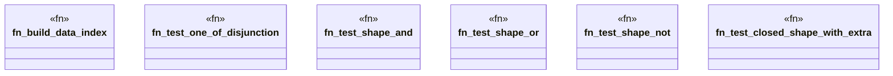

# `crates/praxis-graphlaw/tests/shex_validation_logic.rs`

Source SHA-256: `cc16e08365a4f58cd2750b1a09c36bf5c6d6b5cb831f941cc45457a2678db944`

## Dependencies

- `praxis_graphlaw::parser::{Parser, Syntax}`
- `praxis_graphlaw::shex::validate_shex`
- `praxis_graphlaw::tripleindex::TripleIndex`

## Standing

- Structural parse: `ALIVE`
- Runtime behavior: `UNKNOWN`
