# `crates/praxis-graphlaw/tests/shex_validation_stress.rs`

Source SHA-256: `cc31374b7ac18e05095b01141f50449b6349787d0c9a8d3eeccdf2407439d3cf`

```mermaid
classDiagram
    class fn_build_data_index {
      <<fn>>
    }
    class fn_test_extremely_long_string_datatype {
      <<fn>>
    }
    class fn_test_nested_recursive_references_stress {
      <<fn>>
    }
    class fn_test_stress_empty_and_invalid_inputs {
      <<fn>>
    }
    class fn_test_stress_extremely_long_strings {
      <<fn>>
    }
    class fn_test_stress_nested_recursive_shapes {
      <<fn>>
    }
    class fn_test_stress_deeply_nested_recursion {
      <<fn>>
    }
    class fn_test_stress_shape_map_failures {
      <<fn>>
    }
    class fn_test_stress_missing_properties {
      <<fn>>
    }
```

## Dependencies

- `praxis_graphlaw::parser::{Parser, Syntax}`
- `praxis_graphlaw::shex::validate_shex`
- `praxis_graphlaw::tripleindex::TripleIndex`

## Standing

- Structural parse: `ALIVE`
- Runtime behavior: `UNKNOWN`
