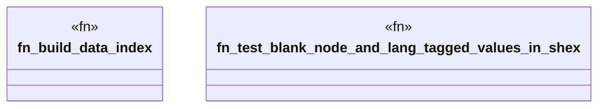

# `crates/praxis-graphlaw/tests/shex_vocabulary_fuzz.rs`

Source SHA-256: `6546eda1d712fcbacf795adda1f1140d7999274d81bf4bdd52d6839027aa13b5`

## Dependencies

- `praxis_graphlaw::parser::{Parser, Syntax}`
- `praxis_graphlaw::shex::validate_shex`
- `praxis_graphlaw::tripleindex::TripleIndex`
- `proptest::prelude::*`

## Standing

- Structural parse: `ALIVE`
- Runtime behavior: `UNKNOWN`
