# `crates/praxis-graphlaw/tests/shexc_parser.rs`

Source SHA-256: `27d3cca9af2f242cbb24c5fb2779478c3808ab8a922e21035e2e752d779a8a46`

```mermaid
classDiagram
    class struct_CaseMeta {
      <<struct>>
      +"source_shexc: String"
    }
    class fn_sorted_shapes {
      <<fn>>
    }
    class fn_shexc_parser_matches_vendored_shexj_for_every_case_with_source {
      <<fn>>
    }
    class fn_one_shape {
      <<fn>>
    }
    class fn_prefix_and_base_resolution {
      <<fn>>
    }
    class fn_base_relative_iri_resolution {
      <<fn>>
    }
    class fn_cardinality_of {
      <<fn>>
    }
    class fn_cardinality_shorthands {
      <<fn>>
    }
    class fn_nested_and_or_not {
      <<fn>>
    }
    class fn_extra_and_closed {
      <<fn>>
    }
    class fn_value_set_with_stem_and_language_tag {
      <<fn>>
    }
    class fn_end_to_end_validation_against_real_data {
      <<fn>>
    }
    class fn_out_of_scope_semantic_action_returns_clear_error_not_panic {
      <<fn>>
    }
    class fn_out_of_scope_triple_expr_label_returns_clear_error_not_panic {
      <<fn>>
    }
```

## Dependencies

- `praxis_graphlaw::TripleStore`
- `praxis_graphlaw::parser::{Parser as RoxiParser, Syntax}`
- `praxis_graphlaw::shex_native::{Schema, ShapeDecl}`
- `praxis_graphlaw::shex_native::{ShapeExpr, ShapeExprOrRef, TripleExpr}`
- `praxis_graphlaw::shexc_parser::parse_shexc`
- `std::fs`
- `std::path::Path`

## Standing

- Structural parse: `ALIVE`
- Runtime behavior: `UNKNOWN`
