# `crates/praxis-graphlaw/tests/soc2_hook_actuation.rs`

Source SHA-256: `ecf692024f894df37a6650e588566a2d68518dba93b400456ab47f9188f93ca3`

```mermaid
classDiagram
    class mod_common {
      <<mod>>
    }
    class fn_iri {
      <<fn>>
    }
    class fn_evidence_sufficiency_hook_pack {
      <<fn>>
    }
    class fn_test_evidence_sufficiency_hook_actuates_control_tested {
      <<fn>>
    }
    class fn_remediation_gate_hook_pack {
      <<fn>>
    }
    class fn_test_remediation_gate_refuses_when_a_critical_exception_is_unremediated {
      <<fn>>
    }
    class fn_cuec_gate_hook_pack {
      <<fn>>
    }
    class fn_test_cuec_gate_refuses_when_sequoia_carve_out_evidence_is_missing {
      <<fn>>
    }
    class fn_test_cuec_gate_does_not_refuse_once_evidence_is_collected {
      <<fn>>
    }
```

## Dependencies

- `common::{assert_contains_triple, assert_not_contains_triple}`
- `praxis_graphlaw::TripleStore`
- `praxis_graphlaw::parser::Syntax`

## Standing

- Structural parse: `ALIVE`
- Runtime behavior: `UNKNOWN`
