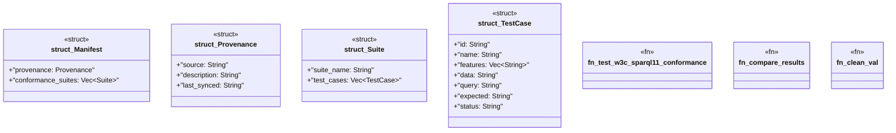

# `crates/praxis-graphlaw/tests/sparql11_conformance/main.rs`

Source SHA-256: `9ceef62a61ee86f5055507def2f66dc8f13f50c5a8fe1f434cc7ed1ad669b96b`

## Dependencies

- `praxis_graphlaw::parser::{Parser, Syntax}`
- `praxis_graphlaw::sparql::{eval_query, evaluate_plan_and_debug, Binding}`
- `praxis_graphlaw::tripleindex::TripleIndex`
- `spargebra::Query`
- `std::collections::HashMap`
- `std::fs`
- `std::path::Path`

## Standing

- Structural parse: `ALIVE`
- Runtime behavior: `UNKNOWN`
