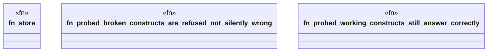

# `crates/praxis-graphlaw/tests/sparql_unsupported_refusal.rs`

Source SHA-256: `e1abf349b38b8e6ed08d511dd81df7aceb4a84f610017ca0abdfe6c3ae575b12`

## Dependencies

- `praxis_graphlaw::TripleStore`
- `praxis_graphlaw::parser::Syntax`

## Standing

- Structural parse: `ALIVE`
- Runtime behavior: `UNKNOWN`
