# `docs/architecture/rdf-control-plane/poka-yoke/newtype-system.rs`

Source SHA-256: `525cd51c89cf4e64b37a93a8b258fdcd6fa6d786520973c7690fef7464a82825`

```mermaid
classDiagram
    class struct_PackageId {
      <<struct>>
    }
    class struct_PackageName {
      <<struct>>
    }
    class struct_SemanticVersion {
      <<struct>>
      +"inner: String"
      +"major: u32"
      +"minor: u32"
      +"patch: u32"
      +"prerelease: Option~String~"
      +"build: Option~String~"
    }
    class struct_AuthorName {
      <<struct>>
    }
    class enum_LicenseId {
      <<enum>>
    }
    class struct_Sha256Checksum {
      <<struct>>
    }
    class struct_Ed25519Signature {
      <<struct>>
    }
    class struct_Ed25519PublicKey {
      <<struct>>
    }
    class mod_state {
      <<mod>>
    }
    class struct_Package {
      <<struct>>
      +"id: PackageId"
      +"name: PackageName"
      +"version: SemanticVersion"
      +"author: AuthorName"
      +"license: LicenseId"
      +"checksum: Sha256Checksum"
      +"_state: PhantomData~State~"
    }
    class struct_PackageBuilder {
      <<struct>>
      +"id: Option~PackageId~"
      +"name: Option~PackageName~"
      +"version: Option~SemanticVersion~"
      +"author: Option~AuthorName~"
      +"license: Option~LicenseId~"
      +"checksum: Option~Sha256Checksum~"
    }
    class mod_tests {
      <<mod>>
    }
    note "AsRef~str~ for PackageId"
    note "AuthorName"
    note "Default for PackageBuilder"
    note "Ed25519PublicKey"
    note "Ed25519Signature"
    note "From~AuthorName~ for String"
    note "From~Ed25519PublicKey~ for String"
    note "From~Ed25519Signature~ for String"
    note "From~PackageId~ for String"
    note "From~PackageName~ for String"
    note "From~SemanticVersion~ for String"
    note "From~Sha256Checksum~ for String"
    note "LicenseId"
    note "Package~State~"
    note "Package~state::Active~"
    note "Package~state::Archived~"
    note "Package~state::Deprecated~"
    note "Package~state::Draft~"
    note "Package~state::Published~"
    note "Package~state::Withdrawn~"
    note "PackageBuilder"
    note "PackageId"
    note "PackageName"
    note "SemanticVersion"
    note "Sha256Checksum"
    note "TryFrom~String~ for AuthorName"
    note "TryFrom~String~ for Ed25519PublicKey"
    note "TryFrom~String~ for Ed25519Signature"
    note "TryFrom~String~ for PackageId"
    note "TryFrom~String~ for PackageName"
    note "TryFrom~String~ for SemanticVersion"
    note "TryFrom~String~ for Sha256Checksum"
    note "fmt::Display for AuthorName"
    note "fmt::Display for Ed25519PublicKey"
    note "fmt::Display for Ed25519Signature"
    note "fmt::Display for LicenseId"
    note "fmt::Display for PackageId"
    note "fmt::Display for PackageName"
    note "fmt::Display for SemanticVersion"
    note "fmt::Display for Sha256Checksum"
```

## Dependencies

- `ggen_core::utils::error::{Error, Result}`
- `serde::{Deserialize, Serialize}`
- `std::fmt`
- `std::marker::PhantomData`
- `super::*`

## Standing

- Structural parse: `ALIVE`
- Runtime behavior: `UNKNOWN`
