# `docs/examples/agent_integration_basic.rs`

Source SHA-256: `f99a50880dcfe41e76e533db4db49c4ecedf10685d81d5c72ad483d08e3b86c1`

```mermaid
classDiagram
    class struct_Signature {
      <<struct>>
      +"name: String"
      +"description: String"
      +"inputs: Vec~InputField~"
      +"outputs: Vec~OutputField~"
    }
    class struct_InputField {
      <<struct>>
      +"name: String"
      +"type_annotation: String"
      +"description: String"
    }
    class struct_OutputField {
      <<struct>>
      +"name: String"
      +"type_annotation: String"
      +"description: String"
    }
    class struct_ToolRegistry {
      <<struct>>
      +"tools: Arc~std::sync::Mutex~std::collections::HashMap~String"
    }
    class struct_ToolImpl {
      <<struct>>
      +"name: String"
      +"signature: Signature"
    }
    class struct_FinancialAgent {
      <<struct>>
      +"id: String"
      +"name: String"
      +"registry: Arc~ToolRegistry~"
    }
    class fn_main {
      <<fn>>
    }
    note "FinancialAgent"
    note "InputField"
    note "OutputField"
    note "Signature"
    note "ToolRegistry"
```

## Dependencies

- `serde_json::json`
- `std::sync::Arc`
- `uuid::Uuid`

## Standing

- Structural parse: `ALIVE`
- Runtime behavior: `UNKNOWN`
