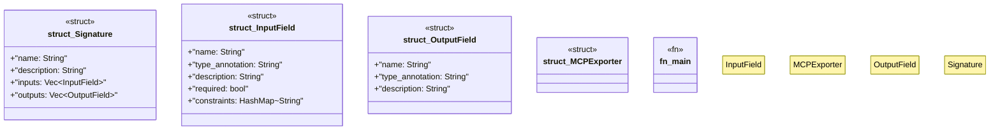

# `docs/examples/mcp_tool_export.rs`

Source SHA-256: `ec882f8a533dea60241caafda3db7c1f9e81021840777bb51f5a8e0aed9e1a01`

## Dependencies

- `serde_json::{json, Value}`
- `std::collections::HashMap`

## Standing

- Structural parse: `ALIVE`
- Runtime behavior: `UNKNOWN`
