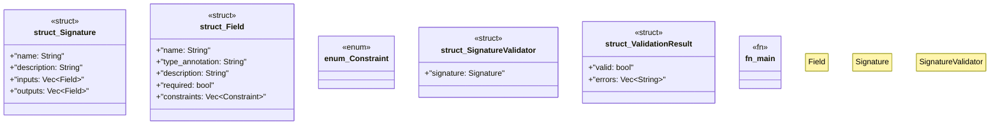

# `docs/examples/signature_validation.rs`

Source SHA-256: `7cc7f76db87de23716b339b06d4564f125ed99770c7b1bc29a5a0630bde6095a`

## Dependencies

- `serde_json::json`
- `std::collections::HashMap`

## Standing

- Structural parse: `ALIVE`
- Runtime behavior: `UNKNOWN`
