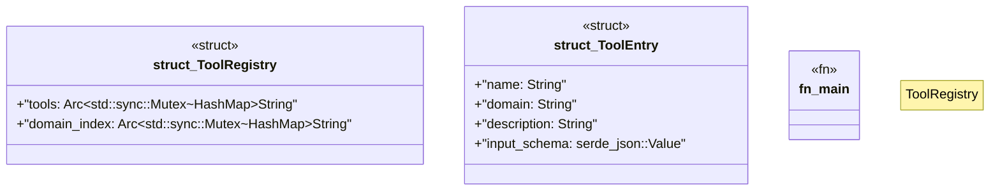

# `docs/examples/tool_registry_usage.rs`

Source SHA-256: `12e11a1dee177b45df3fb73880de708a12e45357fdf85632b876225f24e8c3ce`

## Dependencies

- `serde_json::json`
- `std::collections::HashMap`
- `std::sync::Arc`

## Standing

- Structural parse: `ALIVE`
- Runtime behavior: `UNKNOWN`
