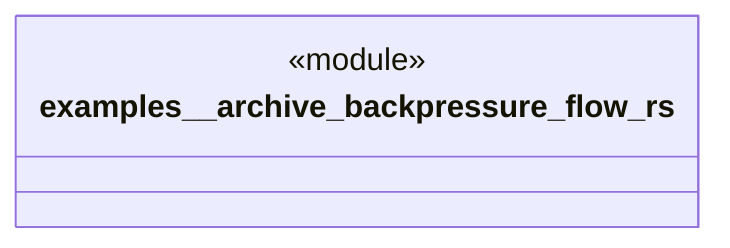

# `examples/_archive/backpressure_flow.rs`

Source SHA-256: `b92d3ee548d14606974cac741ebc359dbbf831cb0bf4be27661fa9fd7cde1c20`

## Dependencies

- `ggen_backpressure::{KanbanBoard, KanbanConfig, Stage}`
- `tokio::time::{sleep, Duration}`

## Standing

- Structural parse: `ALIVE`
- Runtime behavior: `UNKNOWN`
