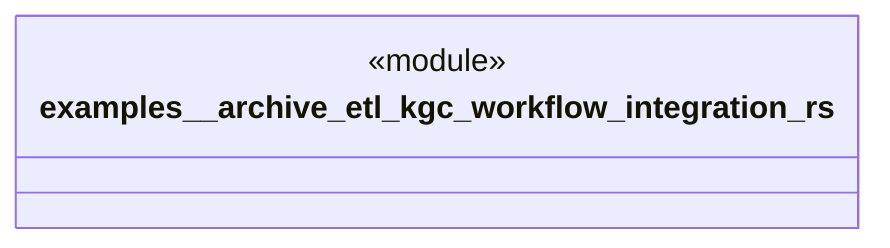

# `examples/_archive/etl-kgc-workflow-integration.rs`

Source SHA-256: `60ef052e21d2bff4b0b0c38bf84019a67ae164cf8bef4d463d757f5b867847ba`

## Dependencies

- `knhk_orchestrator::{ EtlTripleEvent, Orchestrator, OrchestratorConfig, ProcessInstanceEvent, ProcessInstanceState, WorkflowTriggerEvent, }`

## Standing

- Structural parse: `ALIVE`
- Runtime behavior: `UNKNOWN`
