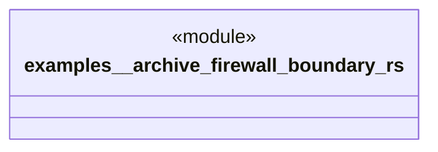

# `examples/_archive/firewall_boundary.rs`

Source SHA-256: `80fb9531ae97f78dd6d4455ba9d8a99d13244b15fb2ad8f3585d9b32e2c2fbd0`

## Dependencies

- `chrono::{Duration, Utc}`
- `ggen_firewall::{ channels::{BatchChannel, EmergencyChannel, ScheduledChannel}, AdmissionResponse, Firewall, IngressChannel, IngressRequest, }`

## Standing

- Structural parse: `ALIVE`
- Runtime behavior: `UNKNOWN`
