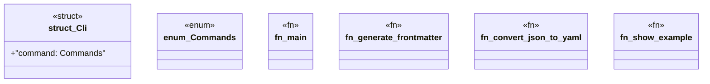

# `examples/_archive/frontmatter-cli.rs`

Source SHA-256: `e8e9ea323241a49d74a8a95a908221a69864a0d3df11536e54a1021ff9230fb3`

## Dependencies

- `clap::{Parser, Subcommand}`
- `serde_json::{json, Value}`
- `std::fs`

## Standing

- Structural parse: `ALIVE`
- Runtime behavior: `UNKNOWN`
