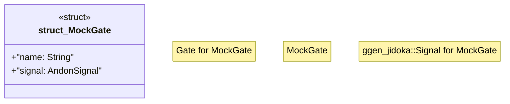

# `examples/_archive/jidoka_line.rs`

Source SHA-256: `0ca58861368607427d66d395a9b57c4a2c9b673ce13cb7faa974fb0cdcc11791`

## Dependencies

- `ggen_jidoka::{ gate::{CompilerGate, LintGate, TestGate}, AndonSignal, Gate, ProductionLine, Result, }`
- `std::sync::Arc`

## Standing

- Structural parse: `ALIVE`
- Runtime behavior: `UNKNOWN`
