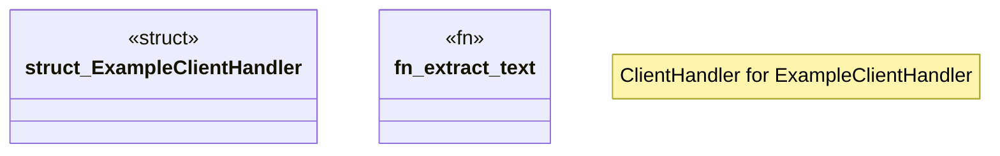

# `examples/_archive/mcp_validate_example.rs`

Source SHA-256: `eed274e8483c53b3059cbff8ead9cf8f40bd81666cfd254cbfa5f12587a934f9`

## Dependencies

- `ggen_a2a_mcp::ggen_server::GgenMcpServer`
- `rmcp::{model::*, service::RunningService, ClientHandler, RoleClient, ServiceExt}`

## Standing

- Structural parse: `ALIVE`
- Runtime behavior: `UNKNOWN`
