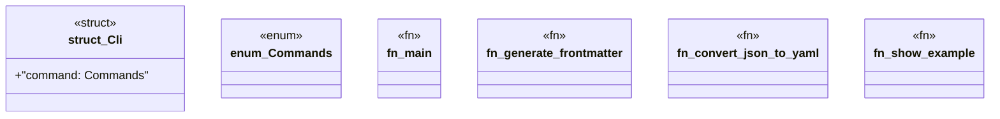

# `examples/_archive/simple-frontmatter-cli.rs`

Source SHA-256: `ced574c92584ede91ed3581d2d39fa138d3bbf0edfdb4ca1adc87813ec82d2e1`

## Dependencies

- `clap::{Parser, Subcommand}`
- `serde_json::{json, Value}`
- `std::fs`

## Standing

- Structural parse: `ALIVE`
- Runtime behavior: `UNKNOWN`
