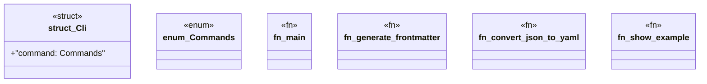

# `examples/_archive/standalone-frontmatter-cli.rs`

Source SHA-256: `a9832f8deb96d6e6101345235c5ee84e0795d5ca24c9912b76bec82fa1ee722c`

## Dependencies

- `clap::{Parser, Subcommand}`
- `serde_json::{json, Value}`
- `std::fs`

## Standing

- Structural parse: `ALIVE`
- Runtime behavior: `UNKNOWN`
