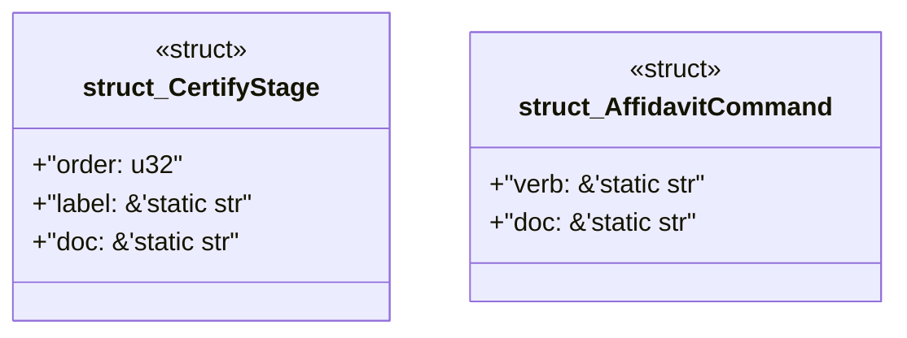

# `examples/affidavit-verify/src/affidavit_catalog.rs`

Source SHA-256: `08dd1664e6039ffaacab35c424f54b690ddb42e74e396955fda05324c15164e0`

## Dependencies

- None observed.

## Standing

- Structural parse: `ALIVE`
- Runtime behavior: `UNKNOWN`
