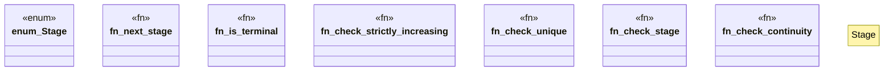

# `examples/affidavit-verify/src/affidavit_certify.rs`

Source SHA-256: `1b1d09b4b48d0a96c00847e1b68a2daea8a90ae5520ed823ee042769b40bb15e`

## Dependencies

- None observed.

## Standing

- Structural parse: `ALIVE`
- Runtime behavior: `UNKNOWN`
