# `examples/affidavit-verify/src/affidavit_chain.rs`

Source SHA-256: `96ea85d9660e44a478c057171b57bbe03dca901e0e583b94a6ca99d9c456953a`

```mermaid
classDiagram
    class enum_ChainError {
      <<enum>>
    }
    class fn_genesis_hash {
      <<fn>>
    }
    class fn_fold_event {
      <<fn>>
    }
    class fn_recompute_chain {
      <<fn>>
    }
    class struct_ChainAssembler {
      <<struct>>
      +"events: Vec~OperationEvent~"
      +"running: Blake3Hash"
    }
    class fn_content_address {
      <<fn>>
    }
    class fn_serialize_receipt {
      <<fn>>
    }
    class fn_deserialize_receipt {
      <<fn>>
    }
    class fn_save_working {
      <<fn>>
    }
    class fn_load_working {
      <<fn>>
    }
    class fn_save_receipt {
      <<fn>>
    }
    class fn_write_file {
      <<fn>>
    }
    class mod_tests {
      <<mod>>
    }
    note "ChainAssembler"
    note "Default for ChainAssembler"
```

## Dependencies

- `crate::affidavit_types::{ObjectRef, OperationEvent}`
- `crate::affidavit_types::{canonical_bytes, Blake3Hash, OperationEvent, Receipt}`
- `std::fs`
- `std::path::Path`
- `super::*`

## Standing

- Structural parse: `ALIVE`
- Runtime behavior: `UNKNOWN`
