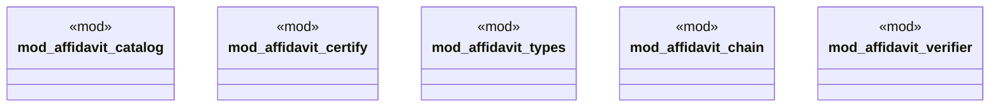

# `examples/affidavit-verify/src/affidavit_lib_wiring.rs`

Source SHA-256: `73924810bc29890dae49c5e57e2e46f1ba69c07b9788bf36d1f437fa977cc9c5`

## Dependencies

- None observed.

## Standing

- Structural parse: `ALIVE`
- Runtime behavior: `UNKNOWN`
