# `examples/affidavit-verify/src/affidavit_types.rs`

Source SHA-256: `275f2b10ed134bb0d22181fb9e82f490130335134383c3d351dba8904999bb6f`

```mermaid
classDiagram
    class struct_Blake3Hash {
      <<struct>>
    }
    class struct_Receipt {
      <<struct>>
      +"format_version: String"
      +"events: Vec~OperationEvent~"
      +"chain_hash: Blake3Hash"
      +"_seal: ()"
    }
    class struct_ObjectRef {
      <<struct>>
      +"id: String"
      +"obj_type: String"
      +"qualifier: Option~String~"
    }
    class struct_OperationEvent {
      <<struct>>
      +"id: String"
      +"seq: u64"
      +"event_type: String"
      +"objects: Vec~ObjectRef~"
      +"payload_commitment: Blake3Hash"
    }
    class struct_CheckOutcome {
      <<struct>>
      +"stage: String"
      +"passed: bool"
      +"detail: String"
    }
    class struct_Verdict {
      <<struct>>
      +"accepted: bool"
      +"profile: ProfileId"
      +"outcomes: Vec~CheckOutcome~"
      +"reason: String"
    }
    class enum_ProfileId {
      <<enum>>
    }
    class fn_canonical_bytes {
      <<fn>>
    }
    class fn_sort_value {
      <<fn>>
    }
    class mod_tests {
      <<mod>>
    }
    note "Blake3Hash"
    note "Deserialize~"
    note "ProfileId"
    note "Receipt"
    note "std::fmt::Display for Blake3Hash"
```

## Dependencies

- `serde::de::Error`
- `serde::{Deserialize, Deserializer, Serialize}`
- `serde_json::Value`
- `super::*`

## Standing

- Structural parse: `ALIVE`
- Runtime behavior: `UNKNOWN`
