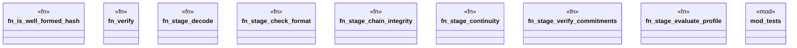

# `examples/affidavit-verify/src/affidavit_verifier.rs`

Source SHA-256: `a8501886233d2486cae22d488d1f566518c49970796b8d6af6deca625587e5a6`

## Dependencies

- `crate::affidavit_chain::{recompute_chain, FORMAT_VERSION}`
- `crate::affidavit_types::{Blake3Hash, ObjectRef, OperationEvent}`
- `crate::affidavit_types::{CheckOutcome, ProfileId, Receipt, Verdict}`
- `std::collections::BTreeSet`
- `super::*`

## Standing

- Structural parse: `ALIVE`
- Runtime behavior: `UNKNOWN`
