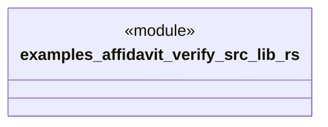

# `examples/affidavit-verify/src/lib.rs`

Source SHA-256: `2bb59a7ff5fa46037cfd419bad6e368a9463c561e27811b2e94b97c17fc5d9a7`

## Dependencies

- None observed.

## Standing

- Structural parse: `ALIVE`
- Runtime behavior: `UNKNOWN`
