# `examples/affidavit-verify/tests/affidavit_certify_proof.rs`

Source SHA-256: `131f23b62ad13232ab406b3af8bfdc6a93f2a89552b4d991134893b2ad584583`

```mermaid
classDiagram
    class mod_affidavit_certify {
      <<mod>>
    }
    class fn_all_stages_len_matches_sparql_derived_count {
      <<fn>>
    }
    class fn_stage_dispatch_walks_the_entire_chain_in_order {
      <<fn>>
    }
    class fn_only_the_last_stage_is_terminal {
      <<fn>>
    }
    class fn_continuity_accepts_empty_sequence {
      <<fn>>
    }
    class fn_continuity_accepts_single_event {
      <<fn>>
    }
    class fn_continuity_accepts_strictly_increasing_sequence {
      <<fn>>
    }
    class fn_continuity_rejects_duplicate_sequence_numbers {
      <<fn>>
    }
    class fn_continuity_rejects_out_of_order_sequence_numbers {
      <<fn>>
    }
    class fn_continuity_rejects_at_the_first_violation_not_the_last {
      <<fn>>
    }
    class fn_reject_condition_text_is_non_empty_for_every_stage {
      <<fn>>
    }
    class fn_only_continuity_has_both_structural_check_flags_set {
      <<fn>>
    }
    class fn_check_stage_on_an_unflagged_stage_trivially_accepts_any_input {
      <<fn>>
    }
    class fn_check_stage_on_continuity_matches_check_continuity_exactly {
      <<fn>>
    }
    class fn_check_unique_alone_is_silent_about_ordering {
      <<fn>>
    }
    class fn_check_strictly_increasing_alone_is_silent_about_duplicates {
      <<fn>>
    }
```

## Dependencies

- `affidavit_certify::{ check_continuity, check_stage, check_strictly_increasing, check_unique, is_terminal, next_stage, Stage, ALL_STAGES, STAGE_CHECKS, }`

## Standing

- Structural parse: `ALIVE`
- Runtime behavior: `UNKNOWN`
