# `examples/affidavit-verify/tests/affidavit_proof.rs`

Source SHA-256: `8a22374bf464554a274a84996a8ef5a89294772f1daf149aba81d70646d62e16`

```mermaid
classDiagram
    class mod_affidavit_catalog {
      <<mod>>
    }
    class fn_certify_stages_has_seven_entries {
      <<fn>>
    }
    class fn_core_verbs_has_four_entries {
      <<fn>>
    }
    class fn_certify_stages_order_is_ascending_one_through_seven {
      <<fn>>
    }
    class fn_certify_stage_1_decode_matches_ontology {
      <<fn>>
    }
    class fn_certify_stage_2_format_check_matches_ontology {
      <<fn>>
    }
    class fn_certify_stage_3_chain_integrity_matches_ontology {
      <<fn>>
    }
    class fn_certify_stage_4_continuity_matches_ontology {
      <<fn>>
    }
    class fn_certify_stage_5_commitment_verify_matches_ontology {
      <<fn>>
    }
    class fn_certify_stage_6_profile_evaluation_matches_ontology {
      <<fn>>
    }
    class fn_certify_stage_7_final_verdict_matches_ontology {
      <<fn>>
    }
    class fn_core_verbs_are_alphabetical_by_verb {
      <<fn>>
    }
    class fn_core_verb_assemble_matches_ontology {
      <<fn>>
    }
    class fn_core_verb_emit_matches_ontology {
      <<fn>>
    }
    class fn_core_verb_show_matches_ontology {
      <<fn>>
    }
    class fn_core_verb_verify_matches_ontology {
      <<fn>>
    }
```

## Dependencies

- `affidavit_catalog::{AffidavitCommand, CertifyStage, CERTIFY_STAGES, CORE_VERBS}`

## Standing

- Structural parse: `ALIVE`
- Runtime behavior: `UNKNOWN`
