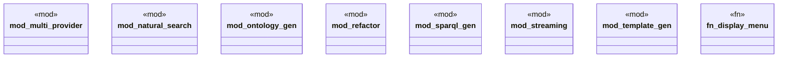

# `examples/archive_ggen_core/advanced-ai-usage/src/main.rs`

Source SHA-256: `b9915568233865132f360f22b9c0e332d3a3c6e580ae50182a8ac8a8fc3c0008`

## Dependencies

- `anyhow::Result`
- `colored::*`
- `std::io::{self, Write}`

## Standing

- Structural parse: `ALIVE`
- Runtime behavior: `UNKNOWN`
