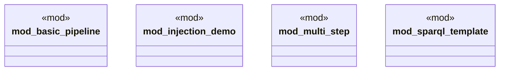

# `examples/archive_ggen_core/advanced-pipeline/src/main.rs`

Source SHA-256: `be227cb6a5fba37ac3a0702f194db169db448b45d24afbf757ba4d1ac6f3f676`

## Dependencies

- `anyhow::Result`

## Standing

- Structural parse: `ALIVE`
- Runtime behavior: `UNKNOWN`
