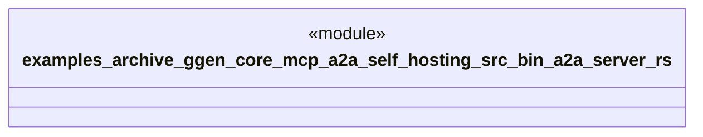

# `examples/archive_ggen_core/mcp-a2a-self-hosting/src/bin/a2a-server.rs`

Source SHA-256: `1c8639e6f3b39a3f0ad7bccb56d237260db134ea32ab8668e673a93f3773510e`

## Dependencies

- `a2a_agents::core::AgentBuilder`
- `mcp_a2a_self_hosting::GgenAgentHandler`

## Standing

- Structural parse: `ALIVE`
- Runtime behavior: `UNKNOWN`
