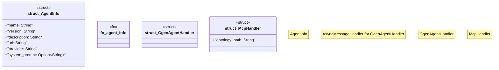

# `examples/archive_ggen_core/mcp-a2a-self-hosting/src/lib.rs`

Source SHA-256: `2fb092b974ab31045df1eb98b758a1487bf4932ac309b0a7d93da3f94e5d9e81`

## Dependencies

- `a2a_rs::domain::{A2AError, Message, Task}`
- `a2a_rs::port::AsyncMessageHandler`
- `async_trait::async_trait`
- `serde::{Deserialize, Serialize}`

## Standing

- Structural parse: `ALIVE`
- Runtime behavior: `UNKNOWN`
