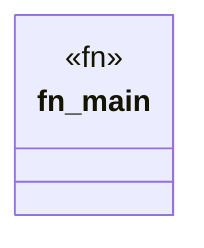

# `examples/archive_ggen_core/stray-rs-files/test_lockfile.rs`

Source SHA-256: `240c7cc144b8178c4eb6108d497572fd04d8fc37fce2f200239dd95725230529`

## Dependencies

- `ggen_marketplace::packs::lockfile::{LockedPack, PackLockfile, PackSource}`
- `std::path::PathBuf`

## Standing

- Structural parse: `ALIVE`
- Runtime behavior: `UNKNOWN`
