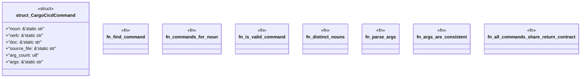

# `examples/cargo-cicd-verify/src/cargo_cicd_catalog.rs`

Source SHA-256: `48d4383ff07d8c6940b31f64ee0eb6a9d73aefc7ca685df316cac84aef2c8d00`

## Dependencies

- None observed.

## Standing

- Structural parse: `ALIVE`
- Runtime behavior: `UNKNOWN`
