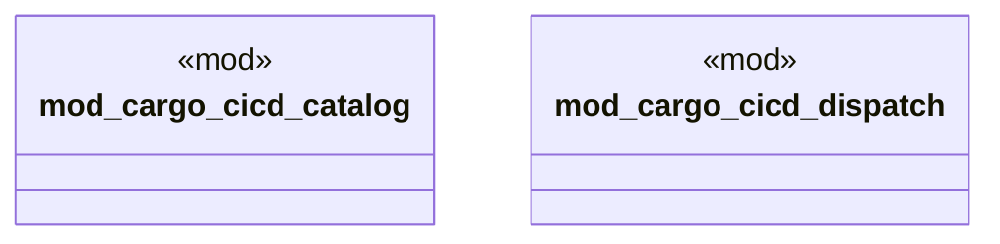

# `examples/cargo-cicd-verify/src/cargo_cicd_lib_wiring.rs`

Source SHA-256: `bb4307cabfd653b88e05689a2dfba1265ee5d8044cae129a2727735fd4f57e99`

## Dependencies

- `cargo_cicd_catalog::{ args_are_consistent, commands_for_noun, distinct_nouns, find_command, is_valid_command, parse_args, CargoCicdCommand, CARGO_CICD_COMMANDS, }`

## Standing

- Structural parse: `ALIVE`
- Runtime behavior: `UNKNOWN`
